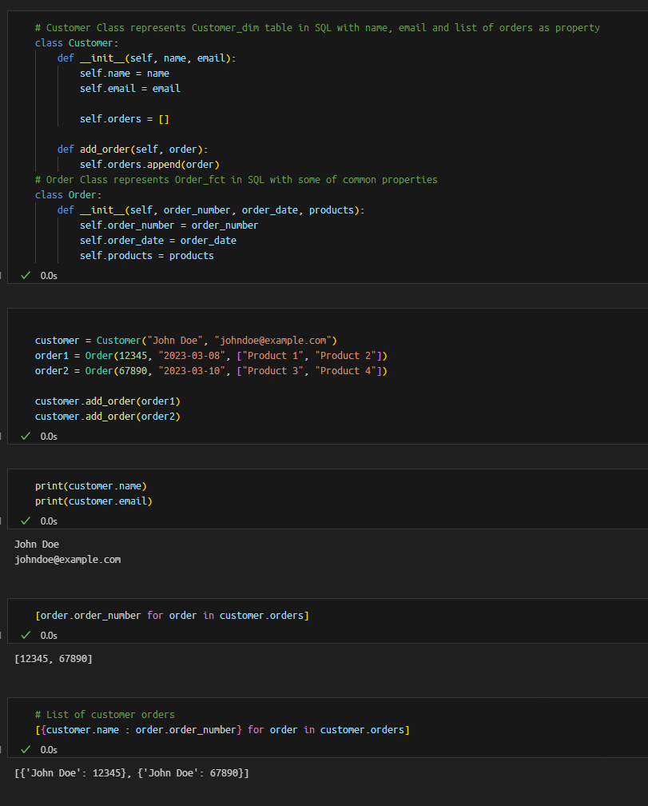

# This repo dedicated for Python OOP including some fundamental and advanced concepts with snippets.

In Python Object Oriented Programming. Association is a relationship between two or more objects. It is a way of representing how objects are connected to each other. 

 

* A Class in Python can represents a table in SQL DBMS.

* Relationship in SQL can be represented by a list in Python.

